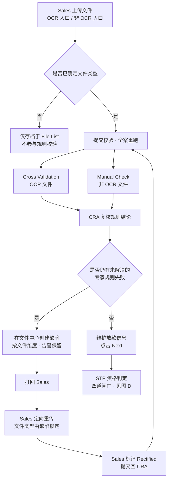
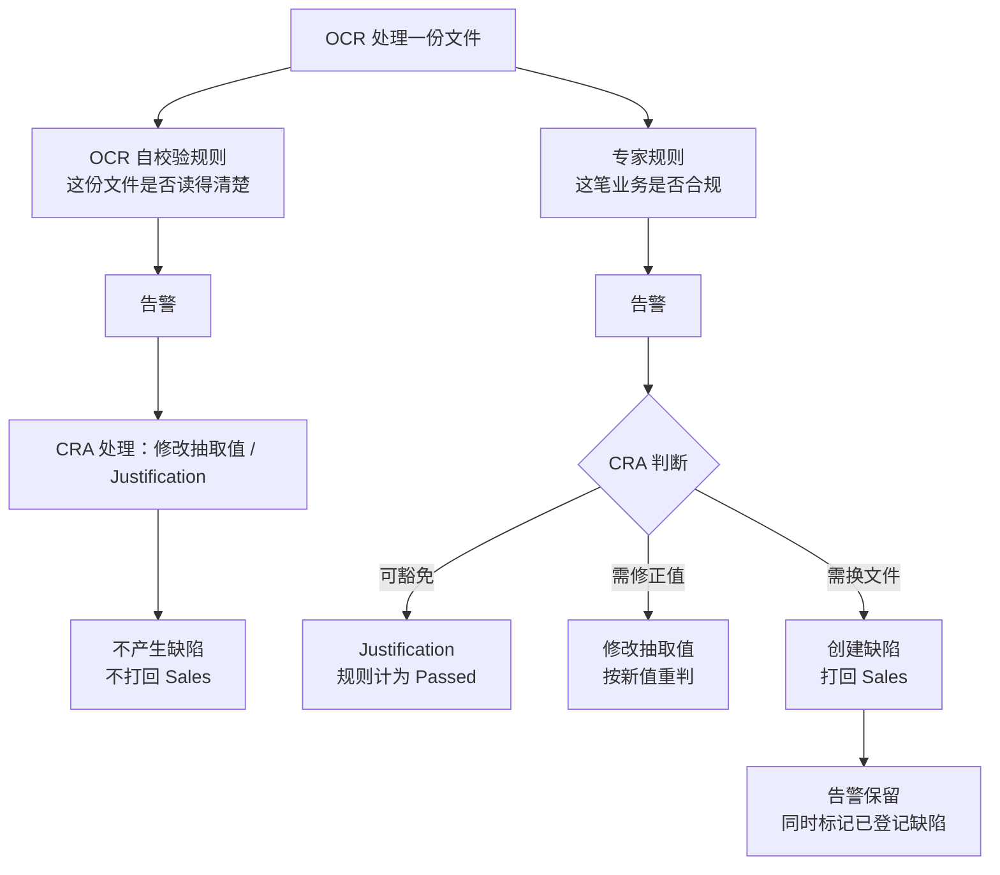
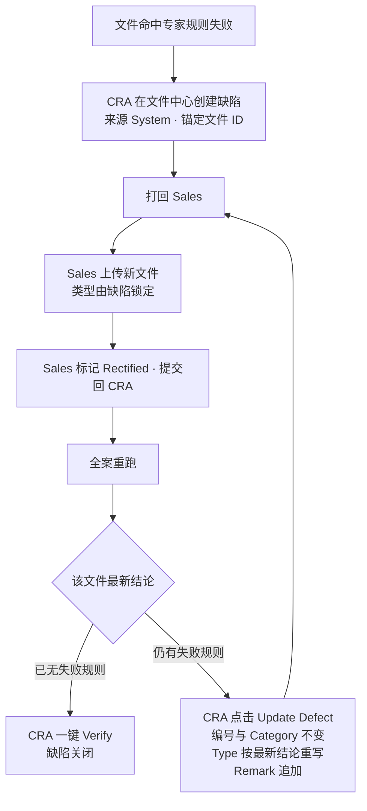
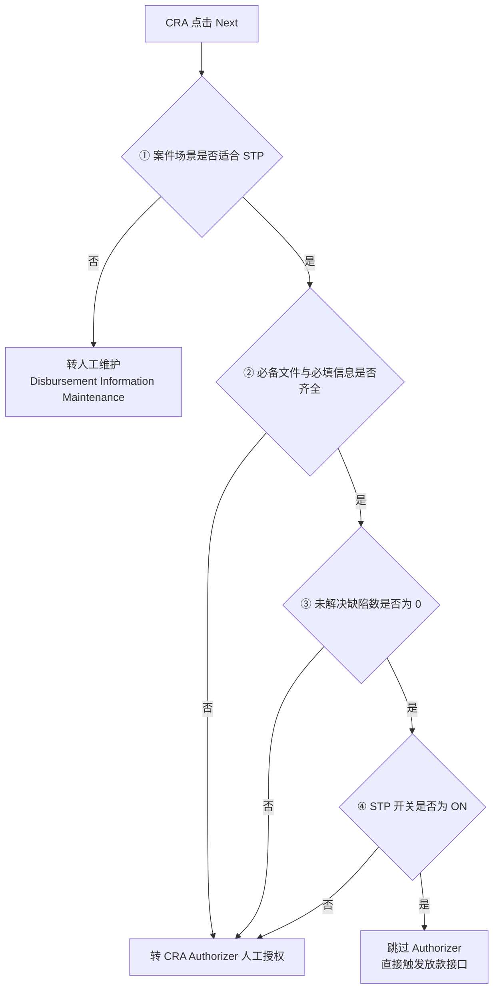

# HLB LOAD$ 放款模块（Batch 3）需求修订稿 v2

**基准文档** `HP_FSD_Batch308Disbursement_2.docx`
**修订依据** 09-03 会议（1h44）、09-04 上午会议（1h31）、09-04 下午会议（3h27）三份逐字稿
**用法** 每条列出「FSD 原章节 → 原文要点 → 修订后中文内容」。中文内容确认无误后逐条译为英文，替换 FSD 对应段落。
**状态** 待核对

---

## 修订清单总览

| # | FSD 章节 | 修订主题 | 性质 |
|---|---|---|---|
| 1 | 3.9.7 / 12.7.6 / 12.7.7 | 缺陷锚定在**文件**上，不在规则上 | 改写 |
| 2 | 2.8.4 / 3.9.5 | OCR 输出两类规则，只有专家规则可产生缺陷 | 新增 |
| 3 | 12.7.4 | Defect Type 改多选；新增关联文件列 | 改写 |
| 4 | 3.9.5 | 创建缺陷后告警保留 | 新增 |
| 5 | 2.9 | 第二轮定向重传：限制文件类型、旧文件保留 | 改写 |
| 6 | 2.8.3 | 已登记缺陷的旧文件不再重复校验 | 新增 |
| 7 | 3.9.3 | 第一轮创建缺陷、第二轮更新缺陷 | 改写 |
| 8 | 3.9.4 | Manual Check 两轮差异、一键通过、文件级入口 | 改写 |
| 9 | 3.9.2 | Header Summary 明细按文件维度 | 改写 |
| 10 | 3.9.6 | 反显门槛：最新版本且无未关闭缺陷 | 新增 |
| 11 | 12.7.5 | 新增 Update Defect 与一键 Verify 操作 | 新增 |
| 12 | 2.7.5 / 2.7.7 | 文件有效性标识、删除级联 | 新增 |
| 13 | 2.7.1 / 2.7.6 | 混合文件与虚拟子文件 ID；others 的边界 | 新增 |
| 14 | 2.8.2 | 非 OCR 侧专家规则全量兜底 | 新增 |
| 15 | 12.7.6 | Add Defect 独立线的边界 | 新增 |
| 16 | 1.4.2 / 2.8.4 / 12.7 / 4.1.2 | 流程图：重画 1.4.2 第二张，另补三张 | 换图 |
| 17 | 4.1.1 / 4.1.2 | STP 准入条件确认 | 确认 |

---

## 1. 缺陷锚定在文件上 —— 3.9.7、12.7.6、12.7.7

**FSD 原文要点**
- 3.9.7 ①：「针对某一条当前失败的规则，用户可手工创建对应的缺陷记录。」
- 12.7.7：去重键为 `Rule ID + File Owner / Entity`。
- 三种创建方式（单条 / 批量 / 同步）均以规则为单位。

**会议结论**（09-03 06:57、09-04 上午 01:05、下午 01:16）
张浩确认生产现状即为「按文件类别登记缺陷」；CRA 遇到一份文件多个问题时，只建一条缺陷，其余问题写进 CRA Remark。三方确认锚点用 **文件 ID** 而非文件类型——「ID 的信息量更大」，同一文件类型下可能有多份文件、多个版本，只有文件 ID 能唯一定位。

**修订后中文内容**

> **缺陷的锚定维度**
> 缺陷锚定在文件上，不锚定在规则上。一份文件对应一条缺陷，该缺陷承载这份文件当前全部失败的专家规则。
>
> - **锚点**：文件 ID。经 OCR 拆分的文件以子文件 ID 为准；非 OCR 文件由用户人工标注多个文件类型时，系统为每个文件类型生成一个虚拟子文件 ID，使两条路径的粒度一致。
> - **去重键**：文件 ID。文件 ID 已唯一确定所属主体与文件类型，涵盖原「Rule ID + 主体」的去重目的，且在同一主体存在多份同类文件时仍然唯一。
> - **Rule–Defect Mapping 保留**：仍作为「失败规则 → Defect Code / Defect Category」的转换依据，转换结果汇入该文件的缺陷，不再各自成条。
> - **一份文件命中多条规则时合并为一条缺陷**，Defect Type 取各规则映射结果的集合，Defect Category 取首条失败规则对应的分类。
>
> **三种创建与同步方式在文件维度下的表述**
> ① 单条创建：针对一份当前存在失败规则的文件，创建对应缺陷；
> ② 批量创建：为所有「存在失败规则且尚未登记缺陷」的文件批量创建缺陷，只新增、不删除、不覆盖；
> ③ 同步系统缺陷：仅作用于来源为 System 的缺陷记录——为尚未登记的失败文件创建缺陷，并删除其关联文件已全部通过的 System 缺陷；来源为 User 的记录不受影响。

**验收点**：一份文件命中 3 条规则 → 缺陷列表只增 1 条、Type 含 3 项；重复点击创建 → 转为更新；主申请人与担保人各一份 MyKad 命中同一规则 → 生成 2 条缺陷。

---

## 2. OCR 输出两类规则 —— 2.8.4、3.9.5

**FSD 原文要点**
2.8.4 列举 OCR 规则类型为 Eyeball Check、公式校验、一致性校验等，未区分规则性质。

**会议结论**（09-03 开场 01:17、01:01:34）
「OCR 在做文件提取的过程当中会处理两类规则：一类是 OCR 为了校验文件准确性、为下游反显服务的自校验规则；另一类是配置进来的专家规则。**只有专家规则类的告警需要建缺陷**，其他类的不需要。」

**修订后中文内容**

> **规则的两个类别**
> OCR 引擎在同一次处理中输出两类校验结果，二者用途不同，处理方式也不同：
>
> | 类别 | 判断的问题 | 举例 | 是否可产生缺陷 |
> |---|---|---|---|
> | 专家规则 | 这笔业务是否符合放款要求 | 保额低于要求、签署日期超出参数、发票日期早于申请日期 | **是** |
> | OCR 自校验规则 | 这份文件是否被正确读取 | 某字段未抽取到、姓名与系统不一致、影像质量导致置信度偏低 | **否** |
>
> 专家规则清单中登记了 Defect Code 的规则方可产生缺陷。为避免依赖隐式判断，OCR 规则清单应显式增加规则类别标识（专家规则 / 自校验）。
>
> **界面要求**：Cross Validation 详情页将两类告警分为两个独立区块展示。专家规则区块提供创建 / 更新缺陷的入口；自校验区块不提供该入口，仅可 Justification 或更换文件，并注明本区块不产生缺陷。
>
> **计数要求**：两类数量分别统计，不合并。文件状态分别显示专家规则告警数与自校验告警数；页签的异常计数与「待处理文件」判定仅统计专家规则。仅剩自校验未处理的文件，不计为待处理文件。

---

## 3. Defect Type 改多选、新增关联文件 —— 12.7.4

**FSD 原文要点**
`Type | Defect Type | Drop list`（单选）；字段表中无「关联文件」「来源」列。

**会议结论**（09-04 上午 00:05:20）
张浩确认多选「是万一想要的一个东西」；现状是选一个 Type、其余写进 CRA Remark。09-03 00:50:35 起对此有完整讨论。

**修订后中文内容**

> Defect List 字段表调整如下：
>
> | 字段 | 修订内容 |
> |---|---|
> | Type | 由单选下拉改为**多选下拉**。创建时由系统按 Rule–Defect Mapping 预填该文件全部失败规则对应的类型，用户可增删 |
> | Source | 新增列（System / User）。System 指在文件中心的规则结果页通过创建缺陷生成；User 指在 Defect List 中人工创建 |
> | Related File | 新增列，显示该缺陷当前关联的文件。一条缺陷可先后关联多份文件，**仅最新一份为当前关联文件**，规则结论以当前关联文件为准；历史关联文件保留可查 |
>
> **外部依赖**：Defect Code 参数表（18.28）需确认支持一条缺陷挂多个 Type。

---

## 4. 创建缺陷后告警保留 —— 3.9.5

**FSD 原文要点**
「若告警未作任何处理而保留，该规则视为 Failed，并可据此登记缺陷。」未说明登记后告警的去向。

**会议结论**（09-04 下午 02:34:55）
明确写下：「对应规则告警保留，且不提供在文件中心查看缺陷的能力，所有缺陷查询在 CRA 工作台。」

**修订后中文内容**

> 创建或更新缺陷后，对应的规则告警**保留**，规则结论仍为 Failed。该告警行同时显示两个标记：告警本身，以及「已登记缺陷」。
>
> 文件中心**不显示缺陷编号、不提供进入缺陷明细的入口**；缺陷的查询与跟踪只在 CRA 工作台的 Defect List 完成，避免形成第二份缺陷台账。
>
> 规则结论转为 Passed 只有三条路径（沿用 3.9.5）：修改抽取值、应用 Justification、更换文件后重跑通过。
>
> **外部依赖**：OCR 侧需支持「存在未关闭告警时保存并落库」。当前实现要求告警全部处理后方可落库，与本条冲突，需 OCR 团队改造。

---

## 5. 第二轮定向重传 —— 2.9

**FSD 原文要点**
2.9 规定打回后 Sales 可新增或替换文件、不可修改既有文件、不可操作规则页；未规定第二轮上传的约束与旧文件的处置。

**会议结论**（09-04 上午 01:09:40，下午 00:20:50、02:37:00）

**修订后中文内容**

> **入口**：Sales 从 Defect List 中缺陷行的操作按钮进入文件中心。进入后仅展示该缺陷关联的文件（含历史关联文件），其余文件不展示。
>
> **文件类型限制**：第二轮上传的文件类型固定为该缺陷关联文件的类型，不可选择、不可修改。
> - 经 OCR 入口上传：若 OCR 识别出的类型与目标类型不一致，**统一输出为 others，不识别、不提取、不校验**；
> - 经非 OCR 入口上传：文件类型由缺陷直接继承，不提供选择。
>
> **others 的提示**：页面须让用户明确知道本次未识别成功及其原因——要么 OCR 不支持该文件，要么上传的不是本缺陷所要求的类型——并引导更换文件重传，不得让用户误以为上传已生效。
>
> **旧文件的处置**：上传新文件后，**旧文件原样保留在文件列表中，系统不做自动处理**（不自动删除、不自动置为失效）。是否清理由客户人工决定，后果自负。文件列表须能区分：本轮新上传的文件、已被新文件顶替的旧文件、以及其余无缺陷的文件。
>
> **缺陷的关联**：新文件上传后成为该缺陷的当前关联文件，规则结论以当前关联文件为准；历史关联文件保留可查。
>
> **一份文件多个问题类型时**：若一次上传的主文件被拆出两个都存在问题的文件类型，即为两条缺陷，需**分别上传两次**，界面不做合并。
>
> **两个入口重复上传同一类文件**：允许。两份文件各自按各自路径校验，各自可产生缺陷，互不合并、互不覆盖。

---

## 6. 已登记缺陷的旧文件不再重复校验 —— 2.8.3

**FSD 原文要点**
2.8.3 已明确「任一文件新增或替换即全案重跑，只保留最新结果」。**该原则不变**。

**会议结论**（09-04 下午 02:21:14）
「OCR 校验时，如果发现旧文件上已经有缺陷，旧文件就不再重新校验，只校验新文件。」

**修订后中文内容**

> 重跑范围仍为全案。但对于已登记缺陷、且已被新文件顶替的旧文件，重跑时不再重复校验，其历史结论保留但不再参与当前结果的计算，也不参与反显。
>
> **展示要求**：重跑是全量的，展示是聚焦的。复核视图默认呈现「本轮结论发生变化的规则」与「挂在本轮被替换文件上的规则」，其余规则保留上一轮结论并折叠，可一键展开。因跨文件规则被牵动而转为失败的规则须单独醒目提示。重跑期间显示重算中状态，结果异步返回后刷新。

---

## 7. Cross Validation：第一轮创建、第二轮更新 —— 3.9.3

**会议结论**（09-04 下午 02:49:00、03:02:03）
「精简一下就是：Cross Validation 第一轮快速创建缺陷，第二轮 Update Defect；Manual Check 第一轮创建缺陷，第二轮 Update Defect，两条线一样。」

**修订后中文内容**

> **第一轮**：CRA 在失败规则处点击创建缺陷，系统弹出缺陷创建窗口，将规则编号、Defect Category、Defect Type、命中说明预填完成，CRA 可补充 CRA Remark 后确认保存。缺陷记录**不得自动创建**，必须由用户主动触发。
>
> **第二轮**：同一位置的按钮变为 **Update Defect**。点击后系统按当前文件最新一轮的规则结论一次性更新原缺陷：
> - Defect Category 不变、缺陷编号不变；
> - Defect Type 按最新规则结论整体重写；
> - CRA Remark 只追加、不覆盖；
> - 若最新一轮该文件已无失败规则，则该动作表现为将缺陷状态更新为 Verified（见第 11 条）。
>
> 更新为**手动触发**，系统不做自动刷新——OCR 重跑存在时间差，且是否构成缺陷需由 CRA 判断。

---

## 8. Manual Check 两轮差异 —— 3.9.4

**会议结论**（09-03 00:21:41–00:24:44、09-04 下午 02:27:53、03:01:26）

**修订后中文内容**

> | 轮次 | 左侧规则栏 | 顶部操作 |
> |---|---|---|
> | 第一轮 | 通栏展示本案全部适用的专家规则，右侧切换文件逐条标记 Pass / Fail | **一键通过（全局）** |
> | 第二轮 | **仅展示该缺陷关联文件类型的规则**，其余已结论的规则不再展示 | 一键通过 + Update Defect |
>
> 补充要求：
> - 创建 / 更新缺陷的入口设在**文件标题行**（文件维度），不只挂在某一条失败规则上；一份文件多条眼查不通过仍是一条缺陷。
> - 替换文件后，该文件下**全部规则需重新标记**，不沿用上一轮结论；与该文件无关的其他文件的规则不需要重新标记。
> - 一次进入若牵涉两条缺陷，允许两条一起标记 Rectified。
> - 系统生成文档走同一条人工判定路径，不做特例。
> - 从文件标题直接创建、且该文件当前无任何规则判为 Fail 时，缺陷来源记为 **User**。

---

## 9. Header Summary —— 3.9.2

**FSD 原文要点**（保留不动）
必备文件数与已上传数、规则总数、已结论数、已结论中 Passed / Failed 数、可展开明细、直达文件中心的快捷链接、失败规则提供创建缺陷入口、Refresh 不触碰缺陷、只显示最近刷新时间不显示操作人。

**修订后中文内容**（在保留上述内容的前提下补充）

> - **展开后的明细按文件维度组织**：一份文件一张卡片，卡片标题为文件名与该文件未通过的规则条数，并提供**唯一**的创建 / 更新缺陷入口；规则行置于卡片内部，仅保留规则级处理动作（修改抽取值 / Justification / 更换文件）。
> - **Passed 的构成**：按 3.9.5，Passed 含「真实通过」「Justification 放行」「人工标记通过」三类。三者责任不同，须在 Passed 数字下以小字标明其中 Justification 放行与人工标记通过的条数。
> - **未登记缺陷数**：Failed 数字下标明其中尚未登记缺陷的文件数，并就近提供批量创建入口。
> - **必备文件的自动回写**：按 3.9.6，Sync from OCR 范围含必备文件清单勾选状态；应在必备文件数字下标明其中由规则全部通过而自动回写的项数。

---

## 10. 反显门槛 —— 3.9.6

**FSD 原文要点**
弹窗比对 OCR 抽取值与页面现值、可选择性回填、回填后可编辑；与 Refresh 完全解耦；Post Maintenance 后不再提供；手写签署内容不参与反显。

**会议结论**（09-04 下午 01:06:12）
「每一次点的时候就去刷新校验，看有没有和缺陷关联的文件、走没走 OCR；只要没有未关闭的缺陷关联，才能把反显字段吐到页面上。」

**修订后中文内容**

> 反显取值须同时满足两个条件：该文件类型下的**最新版本**、且该文件**无未关闭的缺陷**。
>
> - 两个条件任一不满足，该组字段**不反显**，且不回退到旧版本取值；
> - 不反显时须给出可执行的原因，明确指出是哪一条缺陷阻挡，关闭后字段即可回填，不得只留空白；
> - 每次点击 Sync 时重新校验文件与缺陷的关联关系，不使用缓存结论；
> - 已被新文件顶替的旧文件、以及经 Add Defect 线上传的文件，均不参与反显。

---

## 11. 新增 Update Defect 与一键 Verify —— 12.7.5

**会议结论**（09-04 下午 02:45:17、02:49:00）
「第一轮在这提供一个快捷按钮去创建缺陷，第二轮在这提供一个快捷按钮去 Verify。」并确认这两个动作可合并为一个 Update：「Update 其实就是 Verify 加更新缺陷，页面根据实际情况决定是更新内容还是更新状态为 Verified。」

**修订后中文内容**

> Defect List 支持的操作新增两项：
>
> | 操作 | 触发位置 | 说明 |
> |---|---|---|
> | Update Defect | 文件中心的规则结果页（Cross Validation / Manual Check） | 按当前文件最新一轮的规则结论更新缺陷内容 |
> | 一键 Verify | 同上 | 当前文件已无失败规则时，直接将缺陷标记为 Verified，无须返回 Defect List 再次操作 |
>
> 两项操作均为**手动触发**，且**仅适用于来源为 System 的缺陷**。来源为 User 的缺陷不提供上述自动化能力，其 Rectified / Verified 全部人工标记。
>
> Rectified 仍由 Sales 标记，Verified 仍由 CRA 标记，责任划分不变；本条只是把 CRA 的标记动作前移到他实际完成复核的页面上。

---

## 12. 文件有效性与删除级联 —— 2.7.5、2.7.7

**会议结论**（09-04 下午 02:03:44、02:10:54、09-03 00:44:16）

**修订后中文内容**

> **文件列表的状态区分**（2.7.5 补充）
> 第二轮进入文件中心时，文件列表须以视觉方式区分三类文件：
> ① 无缺陷、已复核通过的文件；② 已被本轮新文件顶替的旧文件；③ 本轮新上传、尚待复核的文件。
> 排序上优先展示存在缺陷的文件与本轮新上传的文件。
>
> **删除的级联范围**（2.7.7 补充）
> CDM 侧删除主文件时，OCR 侧由该主文件拆分出的子文件**级联删除**，并同时清理：挂在这些子文件上的规则结论；指向这些文件的缺陷关联（缺陷本身不自动删除，但须标记其关联文件已删除，需针对新文件重新处理）。目的是避免规则或缺陷指向一个已不存在的文件。
>
> 删除仍为人工动作、后果由客户承担，系统只保证两侧一致。

---

## 13. 混合文件与虚拟子文件 ID —— 2.7.1、2.7.6

**会议结论**（09-04 下午 00:30:06「就给它生成三个虚拟的子文件 ID」、03:02:44「CDM 需要主文件与子文件的映射」、03:11:54 others 的边界）

**修订后中文内容**

> **混合文件的粒度对齐**（2.7.1 补充）
> 一个源文件包含多个子文档时：
> - 经 OCR 入口上传的，由 OCR 拆分为子文件，每个子文件有独立的子文件 ID 与文件类型；
> - 经非 OCR 入口上传的，由用户人工标注多个文件类型，系统**为每个文件类型生成一个虚拟子文件 ID**，使规则结论与缺陷的挂载粒度与 OCR 路径一致。
>
> **CDM 须维护主文件与子文件的映射关系**，以支撑缺陷关联、规则结论定位与文件预览。
>
> **others 的边界**（2.7.6 补充）
> 文件类型为 others 的文件不进入后续的规则校验，仅保留在 File List 中供存档与预览。客户如仅需存档、不希望参与专家规则校验，可经 OCR 入口上传并保持 others 状态。

---

## 14. 非 OCR 侧专家规则全量兜底 —— 2.8.2

**会议结论**（09-04 上午 00:35:16）
「OCR 准备的规则是 OCR 自己文件的规则加部分文件的专家规则，但非 OCR 里面的专家规则是全量的——因为可能 OCR 挂了、或者客户就是从非 OCR 入口传上来。」

**修订后中文内容**

> 专家规则的配置范围：OCR 侧配置其支持文件类型对应的专家规则；**非 OCR 侧须配置全量专家规则**，作为以下情形的兜底：
> - OCR 服务不可用；
> - 客户将 OCR 支持的文件类型经非 OCR 入口上传；
> - 专家规则开关（19.1）关闭，全案改为人工核验。
>
> 同一文件类型在两个入口各上传一份时，两份文件分别按所在路径的规则校验，各自产生结论与缺陷，互不合并。

---

## 15. Add Defect 独立线的边界 —— 12.7.6 ①

**会议结论**（09-04 下午 03:10:54–03:23:25）
「手动建的缺陷不给上面那一套功能……相当于保留一个途径，保留原始手工处理的最大自由度。」「先禁止上传到 OCR，避免 OCR 反显有问题。」

**修订后中文内容**

> 在 Defect List 中人工创建的缺陷（来源 = User）适用以下边界，与规则驱动的缺陷明确区分：
>
> | 项 | 规则驱动的缺陷（System） | 人工创建的缺陷（User） |
> |---|---|---|
> | 创建时是否关联文件 | 是，创建自某份文件 | 否，不带任何文件信息 |
> | 上传文件类型 | 由缺陷关联文件的类型锁定 | **不限制** |
> | 可用上传入口 | OCR / 非 OCR 均可 | **禁用 OCR 入口**，仅可上传至 File List 存档 |
> | 是否触发规则校验 | 是，全案重跑 | 否 |
> | 是否参与反显 | 是（须满足第 10 条门槛） | 否 |
> | Update / 一键 Verify | 提供 | 不提供，全人工标记 |
>
> 禁用 OCR 入口的原因须在界面上事前说明（入口置灰并给出文案），不得等用户点击后再报错。

---

## 16. 高层流程图重画 —— 1.4.2

### 16.1 现图的问题

1.4.2 的第二张图存在以下不成立之处：

| # | 问题 | 说明 |
|---|---|---|
| 1 | 判断框分出四条不同性质的分支 | 「Complete Expert Rules assessment」下同时分出 Standard STP case / Other cases（案件类型）与 System-created defect / CRA manually creates a defect（缺陷来源），两组不是同一维度，不能由同一个判断框分出 |
| 2 | 暗示 STP 案件不需人工核验 | 图上 STP 走「OCR-based results reviewed by CRA」、其他案件走「OCR results plus manual verification」。但按 1.4.1 的注释与 4.1 的定义，STP 只是跳过 Authorizer，CRA 的规则复核照常进行 |
| 3 | 缺陷分支是死路 | 两条缺陷分支汇入「Existing Rectify and Verify process」后即终止，看不到「打回 Sales → 重传 → 全案重跑 → CRA 复核」的闭环回到主流程 |
| 4 | 未体现两类规则 | 图上「File recognition and self-validation」与「OCR-driven Expert Rules checks」并列出现，但下游对两者不做区分，与「只有专家规则可产生缺陷」的口径不符 |
| 5 | 未体现 Manual Check 这条线 | 非 OCR 文件的专家规则人工核验只笼统写为 manual verification，看不出它是与 Cross Validation 并列的一条路径 |
| 6 | STP 判定过于简化 | 图上只有一个 STP eligible? 的 Yes / No。按 4.1.2 是四道依次判断的闸门，且不满足时有**两个不同去向**：①不满足 → 转人工维护；②③④不满足 → 转 Authorizer |

### 16.2 建议替换为四张图

原图承担了太多信息。建议拆为四张，各自回答一个问题。

**图 A · 端到端主流程**（替换 1.4.2 第二张图）

**图 B · 两类规则与缺陷的关系**（建议新增于 2.8.4 或 3.9.5）

**图 C · 一条缺陷的生命周期**（建议新增于 12.7）

**图 D · STP 四道闸门与两个去向**（建议新增于 4.1.2）

> 四张图的术语须与正文一致：文件维度、两类规则、四道 STP 闸门、两个不同的路由去向。

---

## 17. STP 准入条件确认 —— 4.1.1、4.1.2

本版 FSD 相较上一版有三处实质变化，请确认是否为最终版本：

| 项 | 上一版 | 本版 |
|---|---|---|
| e | Not FBT | **Not FBR** |
| h | （原为 90 天规则） | **E-Acceptance** |
| i | — | **Non-Panel Dealer** |
| j | — | 90 天规则（原 h 顺延） |

4.1.2 同时删去「系统可提前预判并**在页面上给出相应指示**」中的页面指示要求，以及对 3.9.9 的引用。

**需确认**：e 项由 FBT 改为 FBR 是否为笔误——FBT 与 FBR 在 4.2 及右侧案件标记中同时存在，易混淆。

---

## 18. 待决事项

| # | 事项 | 现状 | 需要谁确认 |
|---|---|---|---|
| 1 | 跨文件规则失败时，缺陷挂被替换的文件还是规则命中的文件 | 原型按「挂被替换的文件」实现 | 业务方 |
| 2 | OCR 分类为 others 的文件，客户手动改成有专家规则的类型后，是否进入 Manual Check | 会上倾向不进；未拍板 | 业务方 + OCR |
| 3 | Defect Code 表是否支持一条缺陷多个 Type | 依赖 ye 提供的参数表 | 参数负责人 |
| 4 | OCR 是否支持「带未关闭告警保存并落库」 | 当前实现要求告警全部处理 | OCR 团队 |
| 5 | STP 准入 e 项 FBT / FBR 口径 | 本版 FSD 已改为 FBR | 业务方 |
| 6 | 无 Full Maintenance 标记的 STP 案件是否止步于放款后转 Post Maintenance | FSD 4.2 标注 To Be Confirmed | 业务方 |
| 7 | 旧文件长期保留在文件列表中，客户是否接受由自己清理 | 会上决定系统不自动处理 | 业务方 |

---

## 附录 · 本版 FSD 与上一版的其他差异

| 章节 | 变化 |
|---|---|
| 12.7.2 | System 来源定义补充为「**在 Verification Summary 页**通过创建缺陷生成」 |
| 12.7.6 ② | 「Summary Area」明确为「**Verification Summary** Area」 |
| 12.7.4 | Sales / CRA Remark 由 VARCHAR2(1000) 改为 **VARCHAR2(500)**；Action 增加 **View**（只读查看，全部字段禁用） |
| 1.4.2 | 「点击页面右下角 Next」明确为「**Detail 页**右下角」 |
| 2.5.2 | FIS 重新查询权限中的「Certain Sales roles【待确认】」落实为 **Sales Manager 与 Sales Head** |
| 7.4 | 新增：Disbursed Pending Post Maintenance 状态下已完成的 FD 质押不可编辑 / 删除；新建 FD 不得与已完成 FD 重复；提交 Post 授权后触发抵押品创建 |
| 13.1 | 新增：仅特定预设角色可删除 / 更新文件模板 |
| 12.5 | Trigger Lodgment 补充页面入口与 Business Code 取值映射 |
| 15 / 16 章 | 章节标题与编号重组 |
| 24 章 | 附录重排：新增 Appendix 4（原型走查）、Appendix 5（Sync From OCR 字段，待更新） |

---

*依据三份会议逐字稿整理。中文核对无误后逐条译为英文，替换 FSD 对应段落。*
